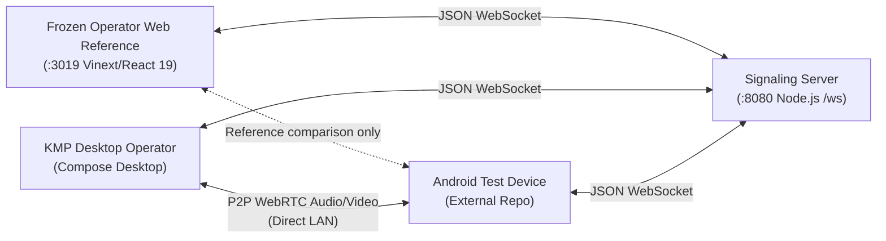

# UBio WebRTC AI Guide

This document is the repository-local AI navigation aid, task router, and execution/safety guard for the `ubio-webrtc` monorepo.

---

## Start Here

- **Navigation Aid Only**: This guide owns routing, boundary constraints, and verification commands. It is not an archive of decisions, meeting notes, or theoretical explanations.
- **Obsidian Wiki SSOT**: The authoritative project knowledge base is located at `Dev/Project/Company/ubio-webrtc/README.md`.
- **Mandatory Session Read Order**:
  1. `Dev/Project/Company/ubio-webrtc/README.md` (Project boundary & publication policy)
  2. `Dev/Project/Company/ubio-webrtc/handoff.md` (Current state, active starting point)
  3. `Dev/Project/Company/ubio-webrtc/issues/needs-verification.md` (Unresolved risks & verification items)
- **Environment & Topology**: Windows development PC (`DESKTOP-PE3TPJN`). The monorepo contains the central signaling server, the validated KMP Desktop operator, and a frozen browser reference operator. Android terminal test client lives in a separate repository (`android-anti-spoofing-lab`).
- **Language & Communication**: English for code comments, commit messages, and AI operating guides (`AGENTS.md`, `CLAUDE.md`).

---

## Product and Runtime Flow



---

## Module Map and First Reads

| Module | Purpose / Technology | First Source Entrypoint | Submodule Guide | Related Wiki Topic |
| --- | --- | --- | --- | --- |
| `signaling-server/` | Central WebSocket signaling relay (Node.js 24, `ws`, Docker) | `signaling-server/src/server.js` | [signaling-server/AGENTS.md](file:///C:/Users/Unionbiometrics/Desktop/company/11.server/ubio-webrtc/signaling-server/AGENTS.md) | `components/signaling-server.md` |
| `operator-web/` | Frozen browser reference client (React 19, Vinext/Vite, Tailwind); no active feature or UI development | `operator-web/app/page.tsx` | [operator-web/AGENTS.md](file:///C:/Users/Unionbiometrics/Desktop/company/11.server/ubio-webrtc/operator-web/AGENTS.md) | `components/operator-web.md` |
| `kmp-operator/` | Active Kotlin Multiplatform Windows Desktop operator development | `kmp-operator/desktopApp/src/main/kotlin/com/sumas/operator/main.kt` | [kmp-operator/AGENTS.md](file:///C:/Users/Unionbiometrics/Desktop/company/11.server/ubio-webrtc/kmp-operator/AGENTS.md) | `technical/kmp-operator-migration-plan.md` |

---

## Task Router

| Developer Intent | First Wiki Page | Primary Source Entrypoint | Downstream Trace Path |
| --- | --- | --- | --- |
| Update signaling protocol / event format | `technical/architecture.md` | `signaling-server/src/server.js` | `kmp-operator/shared/.../SignalingMessage.kt` |
| Compare against the frozen browser reference | `components/operator-web.md` | `operator-web/app/page.tsx` | `operator-web/tests/rendered-html.test.mjs` |
| Develop or verify the KMP Desktop operator | `technical/kmp-operator-migration-plan.md` | `kmp-operator/shared/.../OperatorReducer.kt` | `kmp-operator/desktopApp/.../DesktopOperatorManager.kt` |
| Docker / Signaling deployment setup | `components/signaling-server.md` | `signaling-server/compose.yaml` | `signaling-server/Dockerfile` |
| Investigate unverified audio/video/network issues | `issues/needs-verification.md` | `kmp-operator/desktopApp/.../DesktopOperatorManager.kt` | Physical device test log in wiki |

---

## Immutable Boundaries and Change Gates

1. **Secret & Sensitive Data Boundary**: Never commit or log real internal IPs, URLs, TURN credentials, tokens, or device/customer identifiers.
2. **Port 3019 on Windows Dev PC**: Default port 3000 conflicts on Windows development environments; `operator-web` MUST always run on `--port 3019 --hostname 127.0.0.1`.
3. **Source Code Preservation (`operator-web/build/sites-vite-plugin.ts`)**: `build/sites-vite-plugin.ts` is required source code, NOT a disposable build artifact. Do not delete or clean it.
4. **Frozen Browser Reference**: `operator-web` is retained only for regression comparison. Do not modify its UI, WebRTC flow, dependencies, or configuration unless the user explicitly requests a reference-client change.
5. **KMP Active Development**: The KMP Desktop operator is the active implementation target. Its completed LAN verification establishes a baseline; continue feature development, bug fixes, packaging, and remaining verification within the KMP module.
6. **Separate Android Repository Boundary**: Android client code lives in `android-anti-spoofing-lab`; do not assume Android source files exist in this monorepo.
7. **No Arbitrary `npm audit fix`**: `operator-web` has 18 deferred dependency audit findings pending compatibility review; do not execute automatic audit fixes.

---

## Build and Verification

### 1. Signaling Server
```powershell
cd signaling-server
npm test
# Docker runtime test
docker compose up -d --build
docker compose ps
docker compose down
```

### 2. Operator Web
```powershell
cd operator-web
npm run lint
npm test
# Dev server on port 3019
npm run dev -- --port 3019 --hostname 127.0.0.1
```

### 3. KMP Operator
```powershell
cd kmp-operator
.\gradlew.bat test
.\gradlew.bat desktopApp:test
```
